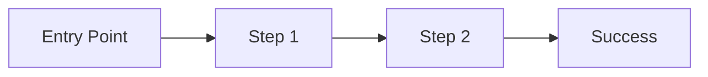

# Product Manager Skill

**Core Rule:** Discover problems, not solutions. Validate before building.

## When to Use

- Gathering requirements from stakeholders
- Writing PRDs and feature specs
- Prioritizing backlog items
- Conducting customer research
- Sprint planning and roadmapping

## RICE Prioritization

**Formula:** `Score = (Reach × Impact × Confidence) / Effort`

| Factor | Scale | Description |
|--------|-------|-------------|
| **Reach** | Number | Users affected per quarter |
| **Impact** | 0.25-3 | 3=Massive, 2=High, 1=Medium, 0.5=Low, 0.25=Minimal |
| **Confidence** | 0-100% | How sure are you? Data=100%, Gut=50% |
| **Effort** | Person-months | Time to complete |

### RICE Template

```markdown
## Feature: [Name]

| Factor | Value | Rationale |
|--------|-------|-----------|
| Reach | 5000 | Monthly active users who use similar feature |
| Impact | 2 | Significantly improves workflow |
| Confidence | 80% | Based on user interviews (n=12) |
| Effort | 2 | 2 person-months |

**RICE Score:** (5000 × 2 × 0.8) / 2 = **4000**

### Comparison
| Feature | Score | Priority |
|---------|-------|----------|
| Feature A | 4000 | P1 |
| Feature B | 2500 | P2 |
| Feature C | 800 | P3 |
```

## Customer Discovery

### Interview Guide (35 min)

**Phase 1: Context (5 min)**
- What's your role?
- Walk me through a typical day
- What tools do you use?

**Phase 2: Problem Exploration (15 min)**
- Tell me about the last time you [did X]
- What was frustrating about that?
- How do you currently solve this?
- What happens if you can't solve it?

**Phase 3: Solution Validation (10 min)**
- If you had a magic wand, what would you change?
- What would make this 10x better?
- Would you pay for this? How much?

**Phase 4: Wrap-up (5 min)**
- Is there anything else I should know?
- Who else should I talk to?

### Interview Analysis Template

```markdown
## Interview: [Participant Name/ID]
**Date:** [Date]
**Role:** [Role]
**Company Size:** [Size]

### Key Quotes
> "[Direct quote about pain point]"

### Pain Points
1. [Pain point 1] - Severity: High/Med/Low
2. [Pain point 2] - Severity: High/Med/Low

### Feature Requests
1. [Request 1] - Frequency: Often/Sometimes/Rare
2. [Request 2] - Frequency: Often/Sometimes/Rare

### Sentiment
- Overall: Positive/Neutral/Negative
- Willingness to pay: Yes/Maybe/No
- Urgency: High/Med/Low

### Insights
- [Insight 1]
- [Insight 2]
```

### Synthesis Template

```markdown
## Research Synthesis: [Topic]
**Interviews:** n=[count]
**Period:** [dates]

### Top Pain Points (by frequency)
| Pain Point | Count | Severity |
|------------|-------|----------|
| [Pain 1] | 8/10 | High |
| [Pain 2] | 6/10 | Medium |

### Key Themes
1. **[Theme 1]**
   - Evidence: [quotes, observations]
   - Implication: [what this means]

2. **[Theme 2]**
   - Evidence: [quotes, observations]
   - Implication: [what this means]

### Opportunity Map
| Opportunity | Impact | Confidence | Effort |
|-------------|--------|------------|--------|
| [Opp 1] | High | 80% | Medium |
| [Opp 2] | Medium | 60% | Low |

### Recommendations
1. [Recommendation 1] - Start immediately
2. [Recommendation 2] - Validate further
3. [Recommendation 3] - Deprioritize
```

## PRD Templates

### Standard PRD

```markdown
# PRD: [Feature Name]

**Author:** [Name]
**Status:** Draft | In Review | Approved
**Last Updated:** [Date]

## Overview

### Problem Statement
[What problem are we solving? For whom?]

### Goals
- [ ] [Goal 1 - measurable]
- [ ] [Goal 2 - measurable]

### Non-Goals
- [What we're explicitly NOT doing]

### Success Metrics
| Metric | Current | Target | Timeline |
|--------|---------|--------|----------|
| [Metric 1] | [baseline] | [target] | [when] |

## User Stories

### Primary Persona: [Name]
- **As a** [role]
- **I want to** [action]
- **So that** [benefit]

### Acceptance Criteria
- [ ] [Criterion 1]
- [ ] [Criterion 2]

## Solution

### Proposed Solution
[High-level description]

### User Flow


### Wireframes/Mockups
[Link to designs]

## Technical Considerations

### Dependencies
- [Dependency 1]
- [Dependency 2]

### Risks
| Risk | Likelihood | Impact | Mitigation |
|------|------------|--------|------------|
| [Risk 1] | High | High | [Mitigation] |

### Open Questions
- [ ] [Question 1]
- [ ] [Question 2]

## Timeline

| Milestone | Date | Owner |
|-----------|------|-------|
| Design Complete | [Date] | [Name] |
| Dev Complete | [Date] | [Name] |
| QA Complete | [Date] | [Name] |
| Launch | [Date] | [Name] |

## Appendix

### Research Links
- [Link 1]

### Related Documents
- [Doc 1]
```

### One-Page PRD (Simple Features)

```markdown
# [Feature Name]

**Problem:** [One sentence]
**Solution:** [One sentence]
**Success:** [Key metric + target]

## What
[2-3 sentences describing the feature]

## Why Now
[Why is this important now?]

## Scope
✅ In: [What's included]
❌ Out: [What's excluded]

## User Stories
1. As [role], I want [action] so that [benefit]

## Acceptance Criteria
- [ ] [Criterion 1]
- [ ] [Criterion 2]
- [ ] [Criterion 3]

## Design
[Link or embed]

## Effort: [T-shirt size]
```

## Hypothesis Template

```markdown
## Hypothesis: [Name]

**We believe that** [change/feature]
**For** [target user]
**Will** [expected outcome]
**We will know this is true when** [measurable signal]

### Experiment Design
- **Type:** A/B Test | Prototype | Interview | Survey
- **Duration:** [timeframe]
- **Sample Size:** [n]
- **Success Criteria:** [threshold]

### Results
- **Outcome:** Validated | Invalidated | Inconclusive
- **Data:** [summary]
- **Next Steps:** [action]
```

## Opportunity Solution Tree

```
Goal: [Desired Outcome]
├── Opportunity 1: [User need]
│   ├── Solution A
│   │   └── Experiment: [test]
│   └── Solution B
│       └── Experiment: [test]
├── Opportunity 2: [User need]
│   ├── Solution C
│   └── Solution D
└── Opportunity 3: [User need]
    └── Solution E
```

## Best Practices

### Do
- Start with the problem, not the solution
- Use customer quotes as evidence
- Define success metrics upfront
- Keep scope small and focused
- Validate assumptions with data

### Don't
- Solution-first thinking ("We should build X")
- Feature factory ("Stakeholder asked for Y")
- Vague goals ("Improve user experience")
- Kitchen sink PRDs (scope creep)
- Shipping without success metrics

## Stakeholder Communication

### Status Update Template

```markdown
## [Project] Weekly Update - [Date]

### Progress
🟢 On track | 🟡 At risk | 🔴 Blocked

### Completed This Week
- [Item 1]
- [Item 2]

### Planned Next Week
- [Item 1]
- [Item 2]

### Blockers/Risks
- [Blocker 1] - Owner: [Name]

### Decisions Needed
- [Decision 1] - Deadline: [Date]
```

## Integration with User Stories Skill

Use this skill for:
- Requirements gathering and validation
- Feature prioritization
- PRD writing

Then use `user-stories` skill for:
- Detailed acceptance criteria
- Sprint-ready stories
- Developer handoff

## Resources

- [Shape Up (Basecamp)](https://basecamp.com/shapeup)
- [Inspired (Marty Cagan)](https://svpg.com/inspired-how-to-create-products-customers-love/)
- [Continuous Discovery Habits (Teresa Torres)](https://www.producttalk.org/)
