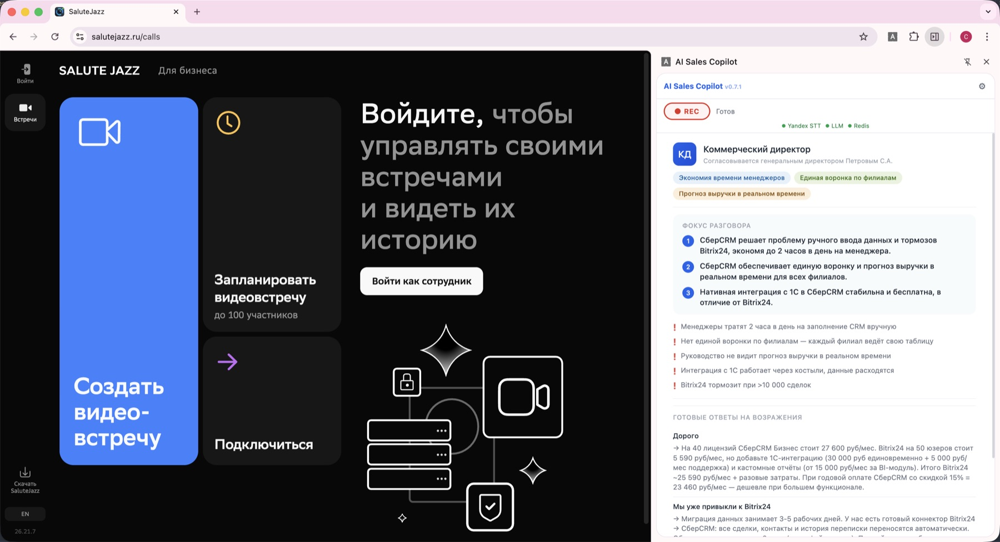
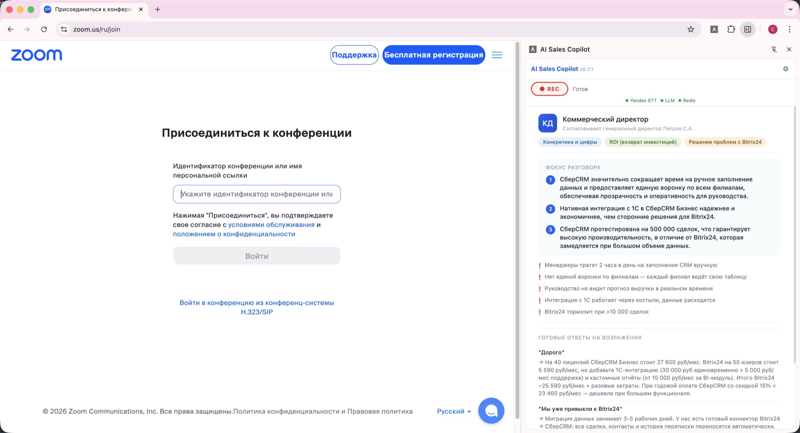

# AI Sales Core

<p align="center">
  
  <br>
  <sub>Side panel during a live call: focus points, ready objection answers, and pain-point highlights, generated from the uploaded knowledge base.</sub>
</p>

Real-time sales assistant for live calls. A Chrome extension captures both audio channels of an in-browser SIP call (rep mic + client tab audio), streams them to a Python backend over WebSocket, and the side panel shows transcripts, talk-ratio coaching, and grounded LLM hints in seconds. Pre-call briefing from uploaded knowledge-base files, post-call evaluation + auto-drafted follow-up email and CRM note.

> **Status:** working MVP, demo-ready. Not a managed product — see [Limitations](#limitations).

### Works on any browser-based call

The extension attaches to whatever tab hosts the call — no provider-side integration. Same side panel, three different platforms:

<table>
  <tr>
    <td></td>
    <td></td>
  </tr>
  <tr>
    <td align="center"><sub><b>Yandex Telemost</b></sub></td>
    <td align="center"><sub><b>Zoom</b></sub></td>
  </tr>
</table>

<sub>SaluteJazz is shown in the hero above. Capture is done via Chrome <code>tabCapture</code> + offscreen <code>getUserMedia</code> — any in-browser call qualifies.</sub>

---

## How it works

```
┌──────────────────────────┐         ┌────────────────────────────────────┐
│ Chrome Extension (MV3)   │         │ Backend (FastAPI, Python 3.11)     │
│                          │         │                                    │
│  service worker          │         │  /ws  WebSocket                    │
│   ├─ tabCapture (client) │  PCM    │   └─► STT (Deepgram /              │
│   ├─ getUserMedia (rep)  │ ──────► │       SaluteSpeech / Yandex)       │
│   └─ offscreen + worklet │  16kHz  │   └─► Orchestrator                 │
│                          │         │       ├─ TalkRatioTracker          │
│  Side panel (Preact)     │ ◄────── │       └─ LLM (OpenRouter, SGR)     │
│   ├─ Brief panel         │  hints  │                                    │
│   ├─ Live-call panel     │  trans- │  /api/v1/briefing  (RAG over docs) │
│   └─ Evaluation report   │  cripts │  /api/v1/evaluation                │
└──────────────────────────┘         │  /api/v1/upload (PDF/XLSX/MD → KB) │
                                     │                                    │
                                     │  Redis  (session state)            │
                                     │  ChromaDB (briefing vectors)       │
                                     └────────────────────────────────────┘
```

The Preact side panel uses `@preact/signals` for reactive state. The backend pins LLM output to a Pydantic schema (Schema-Guided Reasoning) so the frontend gets a stable contract for hints, talk ratio, briefing blocks, and evaluation.

---

## Quick start

### 1. Backend

```bash
uv sync                                      # install deps into .venv
cp backend/.env.example backend/.env
$EDITOR backend/.env                          # fill in API keys
uv run uvicorn backend.main:app --reload --port 8000
```

In another terminal:

```bash
docker compose up redis                      # or any Redis on :6379
```

### 2. Chrome extension

```bash
cd extension
pnpm install
pnpm run build                               # outputs to extension/dist
```

In Chrome → `chrome://extensions` → enable Developer Mode → **Load unpacked** → select `extension/dist`.

Click the extension icon to open the side panel. Upload knowledge-base files, hit **Prepare for Call**, then start an audio capture.

### 3. Test mode (no SIP call required)

The extension has a built-in test toggle that opens the WS without capturing real audio — useful for iterating on UI/hints with synthetic transcripts. It's labeled in the side panel.

---

## Configuration

All backend config is in `backend/.env` (loaded by `pydantic-settings`). Full reference in `backend/.env.example`. Key vars:

| Variable | Purpose |
|----------|---------|
| `STT_PROVIDER` | `deepgram` (default) / `salutespeech` / `yandex` |
| `DEEPGRAM_API_KEY` | Deepgram WebSocket STT |
| `SBER_SPEECH_API_KEY`, `SBER_SPEECH_SCOPE` | SaluteSpeech (gRPC). Requires the public Russian Trusted Root CA cert at `backend/certs/russian_trusted_root_ca.pem` (already in repo) |
| `YANDEX_SPEECHKIT_API_KEY` | Yandex SpeechKit |
| `OPENROUTER_API_KEY` | LLM gateway. Default models: `google/gemini-2.5-flash` (primary), `openai/gpt-4.1-mini` (fallback) |
| `REDIS_URL` | `redis://localhost:6379` |
| `LOG_LEVEL`, `VAD_THRESHOLD`, `SESSION_IDLE_TIMEOUT_S`, `HINT_CONTEXT_UTTERANCES` | Runtime tuning |

You only need keys for the providers you want to use. Backend will start without keys; calls to unconfigured providers return clear errors.

---

## Tech stack

**Backend** — Python 3.11, FastAPI, Uvicorn, Pydantic v2 (with `Field(description=...)` SGR), Redis, ChromaDB + sentence-transformers, OpenRouter, Deepgram SDK, SaluteSpeech via gRPC, Yandex SpeechKit, loguru. Managed with `uv`.

**Extension** — Manifest V3, TypeScript (strict), Preact 10 + `@preact/signals`, Vite + `vite-plugin-web-extension`, Vitest + `@testing-library/preact`. Audio worklet for resample/VU.

**Tooling** — `ruff`, `mypy`, `pytest` (≈370 tests), `pnpm`, `vitest`, `just`, optional Docker Compose (backend + Redis).

---

## Common commands

```bash
just --list                  # discover all recipes
just dev                     # backend + extension watch
just test                    # uv run pytest
just lint                    # ruff + mypy

uv run pytest backend/tests
cd extension && pnpm test
cd extension && pnpm run build   # bumps manifest version, builds worklet + extension
```
